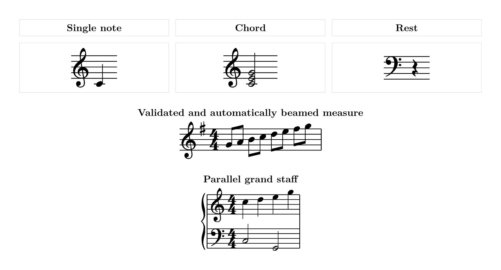
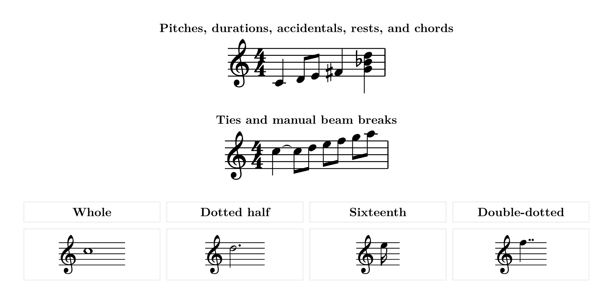
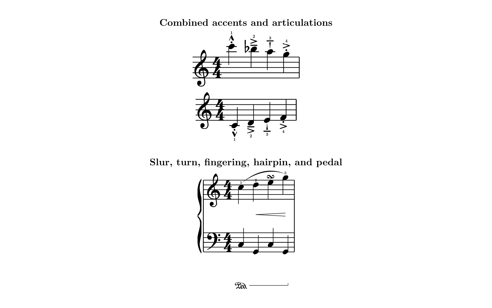
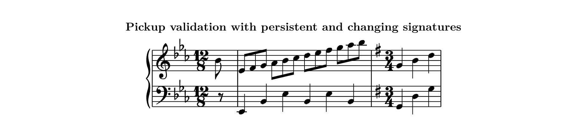
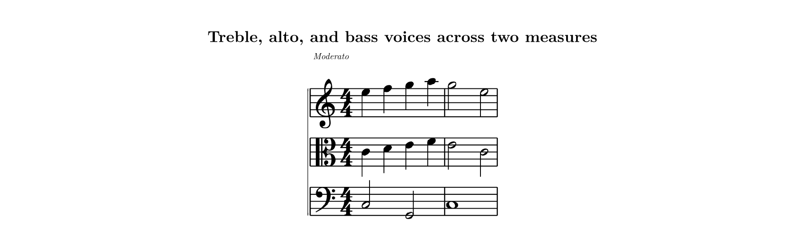

# typed-scores


`typed-scores` engraves western music notation directly in Typst. Write notes,
chords, rests, ties, slurs, directions, and complete measures as compact text;
the package validates the music, computes the layout, and draws a score with
bundled Bravura glyphs through [CeTZ](https://typst.app/universe/package/cetz).

```typst
#import "@preview/typed-scores:0.1.0": *
```

For the complete notation grammar, argument reference, validation rules, and
worked piano score, see the
[documentation PDF](https://github.com/GeronimoCastano/typed-scores/blob/main/docs/documentation.pdf).

## Quick Start

Render a note, chord, or rest with `note`:

```typst
#note("C4:q", clef: "treble")
#note("(C4 E4 G4):h", clef: "treble")
#note("r:q", clef: "bass")
```

Render and validate one measure with `bar`:

```typst
#bar(
  "G4:e A4:e B4:e C5:e D5:e E5:e F5:e G5:e",
  clef: "treble",
  key: "G",
  time: "4/4",
  beams: true,
)
```

Render a grand staff from parallel treble and bass measures:

```typst
#score(
  treble: (
    "C5:q D5:q E5:q F5:q",
    "G5:q A5:q B5:q C6:q",
  ),
  bass: (
    "C3:h G2:h",
    "C3:h G2:h",
  ),
  time: "4/4",
)
```



## Note Language

Each event has a pitch and duration. A colon is optional in compact notation.

| Syntax | Meaning |
|---|---|
| `C4:q` or `C4q` | C4 quarter note |
| `Bb4:e.` | B-flat dotted eighth |
| `(C4 E4 G4):h` | C-major half-note chord |
| `r:q` | Quarter rest |
| `_` | Rest that fills part of the remaining measure |
| `~` | Tie the preceding note or chord to the next event |
| `/` | Break the automatic beam before the next event |
| `[s1(]` … `[s1)]` | Named slur |

Duration letters are `w` (whole), `h` (half), `q` (quarter), `e` (eighth),
`s` (sixteenth), and `t` (thirty-second). Append `.` or `..` for dotted and
double-dotted values. Pitches use scientific pitch notation; append `#` or `b`
before the octave for a sharp or flat.



## Expressive Notation

Annotations go in square brackets after an event. Separate multiple marks with
spaces.

```typst
#bar(
  "G5:q.[f=4] F5:e[f=3 s1(] G5:e[f=4] Eb5:e[f=2 s1)]",
  key: "Eb",
  time: "6/8",
)
```

| Annotation | Result |
|---|---|
| `f=4` | Fingering outside any articulation stack |
| `stacc` | Staccato |
| `staccatissimo` | Wedge staccatissimo |
| `tenuto` or `legato` | Tenuto line |
| `accent` | Accent |
| `marcato` or `strong` | Marcato |
| `text=espress._dolce` | Italic text below the staff; `_` becomes a space |
| `text-below=Ped._simile` | Italic text below pedals and beams |
| `turn` | Turn ornament |
| `chromatic-turn turn-f=12121` | Turn with flat/natural auxiliaries and fingering |
| `s1(` … `s1)` | Named slur; names may span measures |
| `p1(` … `p1)` | Pedal mark and release bracket |
| `h1<` … `h1!` | Crescendo hairpin |
| `h1>` … `h1!` | Diminuendo hairpin |

IDs (`s1`, `p1`, `h1`) pair starts and stops. Use a different ID for every
simultaneously open or overlapping span.

Articulations may be combined, for example `[marcato stacc]`,
`[tenuto staccatissimo]`, or `[accent tenuto]`. The stack is placed on the
notehead side of the stem: above stem-down notes and below stem-up notes.



## Measures, Pickups, And Signatures

The `bars:` form is the most explicit score input. Key and time signatures
persist until a later measure changes them.

```typst
#score(
  bars: (
    (
      key: "Eb",
      time: "12/8",
      partial: "1/8",
      treble: "Bb4:e",
      bass: "r:e",
    ),
    (
      treble: "G5:q. F5:e G5:e Bb5:e Ab5:q. G5:q F5:e",
      bass: "Eb2:e (G3 Eb4):e (Bb3 Eb4 G4):e Eb2:e (Ab3 D4):e (Cb4 D4 Ab4):e Eb2:e (G3 Eb4):e (Bb3 Eb4 G4):e D2:e (G3 Eb4):e (Bb3 Eb4 G4):e",
    ),
  ),
  beams: true,
)
```

`partial:` gives an exact pickup duration such as `"1/8"`. The package still
validates every staff against that duration. In full measures, `_` placeholders
divide the remaining duration into representable rests.

Accidentals follow score rules: the key signature supplies the default,
natural signs cancel it, and an accidental persists for that pitch through the
rest of the measure.



## Longer Scores

Use `sections:` when key, meter, tempo, or instrumentation changes over a
larger piece. Each voice has a stable name, clef, and array of measures.

```typst
#score(
  sections: (
    (
      key: "C",
      time: "4/4",
      tempo: "Moderato",
      voices: (
        (name: "Violin I", clef: "treble", notes: (
          "E5:q F5:q G5:q A5:q",
          "G5:h E5:h",
        )),
        (name: "Viola", clef: "alto", notes: (
          "C4:q D4:q E4:q F4:q",
          "E4:h C4:h",
        )),
        (name: "Cello", clef: "bass", notes: (
          "C3:h G2:h",
          "C3:w",
        )),
      ),
    ),
  ),
  beams: true,
)
```

Scores wrap automatically to the available Typst layout width. Set
`wrap: false` for one unbroken system, `width:` to control the packing width,
`system-gap:` for vertical separation, and `staff-gap:` when a passage needs
extra room between staves.



## Worked Example: Chopin

[`examples/chopin-opening.typ`](examples/chopin-opening.typ) contains the
opening pickup and measures 1–2 of Frédéric Chopin’s Nocturne in E-flat major,
Op. 9 No. 2. It is the package’s release-gate fixture and exercises pickup
validation, 12/8 beaming, octave-spanning piano texture, ties, nested slurs,
fingerings, a chromatic turn, natural cancellation, hairpins, and pedal spans.

The musical text was checked against the public-domain 1881 G. Schirmer score
available from the
[Library of Congress](https://www.loc.gov/item/2023842215/) and the
[Mutopia transcription](https://www.mutopiaproject.org/cgibin/piece-info.cgi?id=1590).

## Validation

`typed-scores` reports an error when:

- a pitch, duration, clef, key, or time signature is malformed;
- a measure does not equal its declared `time:` or `partial:` duration;
- parallel voices have different measure counts;
- a score changes its voice structure halfway through;
- a named slur closes without opening, opens twice, or never closes.

These checks run while Typst compiles the document, close to the source that
needs correction.

## Architecture

The package has two layers:

- A Rust/WASM plugin parses events, computes exact rational durations and
  onsets, maps pitches to staff positions, and assigns beat-aware beam groups.
- Typst and CeTZ align voices, pack systems, place bundled Bravura SVG glyphs,
  and draw stems, beams, curves, barlines, braces, directions, and annotations.

No music font installation is required. Bravura glyph assets are included
under the SIL Open Font License; package code is MIT licensed.

## Current Limitations

- One rhythmic voice per staff is supported. Independent simultaneous voices
  on the same staff are not yet modeled.
- Grace-note timing, tuplets, tremolos, arpeggio signs, lyrics, and repeat/end
  barlines are not yet part of the public DSL.
- Collision avoidance covers core notes, accidentals, beams, ties, and slurs;
  dense editorial markings may still require `staff-gap`, `note-spacing`, or
  `scale` adjustments.

## License

MIT for package code and OFL-1.1 for the bundled Bravura glyphs.
